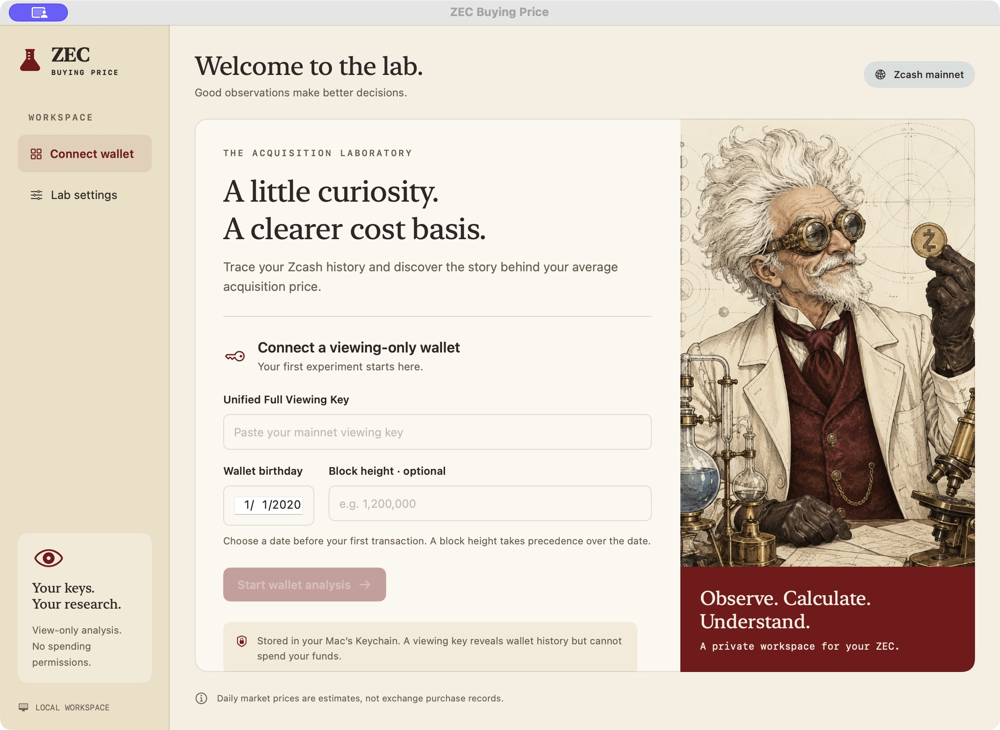
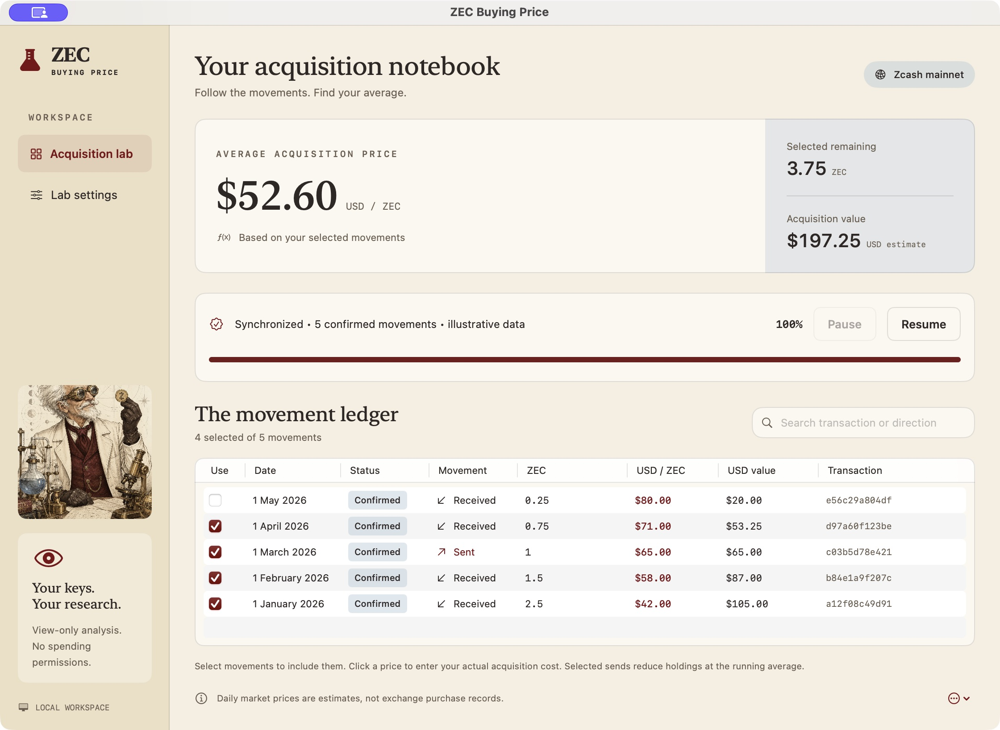
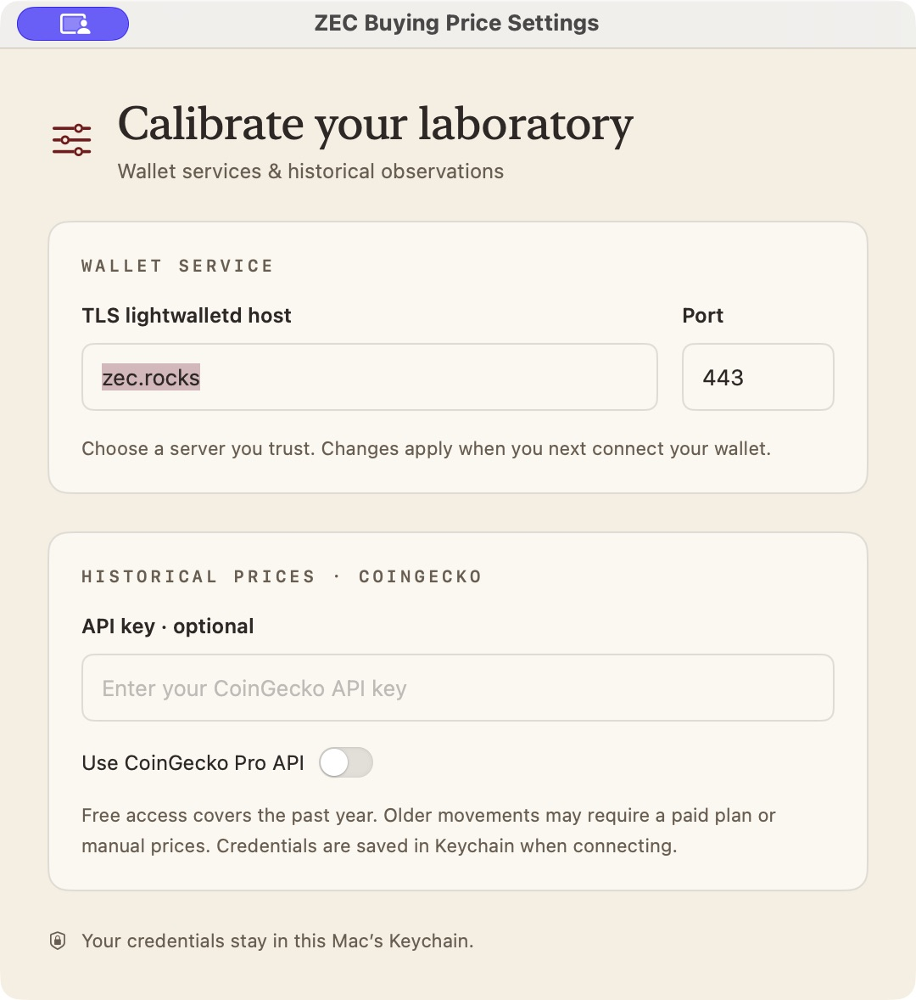
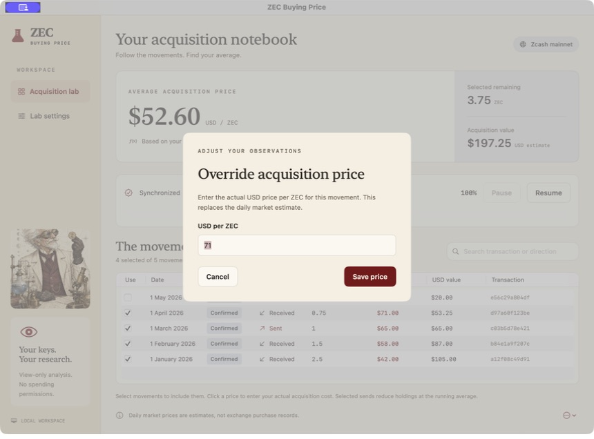
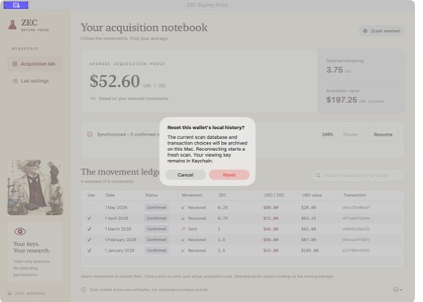

# ZEC Buying Price

A native macOS 14+ application for estimating the average acquisition price of selected Zcash wallet movements. It imports a mainnet Unified Full Viewing Key through ZcashLightClientKit 3.0.0 and uses CoinGecko daily USD prices.

## Screenshots

Captured from the native macOS app. The acquisition dashboard and dialogs use synthetic transactions and prices for illustration; they do not show a real wallet or establish successful synchronization. The temporary screenshot fixture is not included in the application.

### Wallet setup

Connect a mainnet viewing key and choose the wallet birthday.



### Acquisition dashboard

Review the average acquisition price, remaining selected holdings, scan progress, and transaction selections.



### Lab settings

Configure the TLS lightwalletd endpoint and optional CoinGecko API access.



### Manual acquisition price

Override a movement's daily market estimate with an actual USD price per ZEC.



### Reset confirmation

Review the confirmation before archiving local scan history and transaction choices.



## Requirements

- macOS 14 or later.
- Xcode with Swift 6 or later and its command-line tools selected.
- Internet access to download dependencies and scan a wallet.

## Run

```sh
swift test
./script/build_and_run.sh
```

The script creates `dist/ZECBuyingPrice.app`, signs it locally, and launches it. The Codex Run action invokes the same script. Additional modes are `--verify`, `--debug`, `--logs`, and `--telemetry`. The first build downloads the official SDK binary and networking dependencies.

## Use

1. Enter a mainnet Unified Full Viewing Key and a date before the wallet's first activity. An optional birthday block height takes precedence.
2. Open Settings to configure the TLS lightwalletd endpoint and optional CoinGecko Demo or Pro API key. The default endpoint is `zec.rocks:443`.
3. Start scanning. The full average is withheld until synchronization and required receipt pricing finish.
4. Toggle each transaction's inclusion checkbox. Click its USD-per-ZEC price to enter a manual override. Choices persist across rescans and restarts.

The viewing key and API key are saved in Keychain. Wallet scan state, price cache, and transaction choices live under `~/Library/Application Support/ZECBuyingPrice/`. Price requests contain only the asset and date. Viewing keys reveal financial history; the application does not request spending keys or sign transactions.

## Calculation

Selected confirmed receipts add ZEC and acquisition value at the historical or manually entered price. Selected sends remove ZEC and acquisition value proportionally at the running average. Sending does not change the average of the remaining holdings. Pending movements are excluded. Network fees are available in transaction tooltips and do not form purchases. The selected accounting ledger is distinct from the actual wallet balance.

Missing prices and sends exceeding the selected holdings prevent a complete average. Excluding a receipt can make later selected sends inconsistent. SDK output information is reconciled against each transaction's account balance change; ambiguous history fails visibly rather than being presented as a complete average.

## Historical-price limitations

Market-price estimates are not actual exchange purchase records. CoinGecko's daily historical observation is used for the transaction's UTC date; manual overrides can represent the actual acquisition price. Free historical access is limited to one year. Older transactions can require a paid API plan or manual prices. Requests are cached per UTC day and throttled.

Birthday dates resolve conservatively against actual timestamps from the SDK release's mainnet checkpoints, with a two-day margin. This may scan earlier than the requested date. The SDK also rounds explicit heights to its available checkpoint. Key pool/account coverage determines visible history.

## Verification status

The native executable builds and the packaged application launches. All 17 tests pass. Automated tests cover moving-average accounting, exclusion, liquidation, missing prices, oversends, exact zatoshis, UTC dates, price response decoding, persistence, pending exclusion, same-block transaction ordering, ownership-based self-transfer/change exclusion, and reconciliation of incomplete output history. SDK integration tests validate an official public mainnet UFVK fixture, reject invalid/wrong-network keys, import a real view-only account against the default endpoint, and observe live scan progress followed by a successful pause.

Complete receipt/spend scanning, interruption/resume, and controlled reorg behavior remain under verification. A live test that required contiguous scan height to advance within 60 seconds failed: scan progress reached 4% while the SDK scanned newer ranges first. The corrected progress/pause test passes; it does not establish full scan completion. The app is currently a development build, not a verified production release.

## Sources

- [Zcash Swift SDK](https://github.com/zcash/zcash-swift-wallet-sdk), including mainnet checkpoint timestamps and public key test fixture.
- [Public SDK viewing-key fixture](https://github.com/zcash/zcash-swift-wallet-sdk/blob/055145a4b2b8e57eb8673d16708dd8c3f0dbb13e/Tests/OfflineTests/DerivationToolTests/DerivationToolMainnetTests.swift), verified byte-for-byte against the integration-test key.
- [Default server information](https://hosh.zec.rocks/zec/zec.rocks).
- [CoinGecko historical coverage](https://support.coingecko.com/hc/en-us/articles/4538747001881-What-granularity-do-you-support-for-historical-data).
